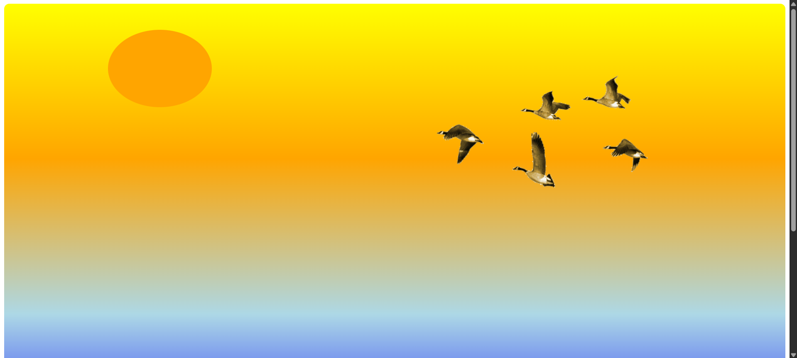

# 🕊️ Flying Birds Animation

A simple web page that creates a relaxing **evening view** with a **flying birds GIF** animation.  
This project demonstrates basic use of **HTML & CSS** for layout, positioning, and background design.

---

## 🌐 Live Demo
👉 [View Here](https://nitesh-shaw-098.github.io/Flying-birds-animation/)

---

## 📌 Features
- Flying birds animation using a GIF.
- Styled evening background with gradient effects.
- Responsive positioning for a smooth viewing experience.
- Lightweight and runs directly in the browser (no dependencies).

---

## 🚀 Technologies Used
- **HTML5** – for page structure  
- **CSS3** – for background styling & positioning  

---

## 📂 Project Structure
Flying-birds-animation/
│── index.html # Main HTML file
│── style.css # Stylesheet for background & layout
│── assets/ # (Optional) folder for GIFs/images


---

## ▶️ How to Run
1. Clone this repository:
   ```bash
   git clone https://github.com/nitesh-shaw-098/Flying-birds-animation.git

2. Open `index.html` in your web browser.
3. Enjoy the evening view with flying birds 🌆🕊️

---

## 📸 Preview




---

## 🙌 Author

Created by **[Nitesh Shaw](https://github.com/nitesh-shaw-098)**

---

## 📜 License

This project is open-source and available under the **MIT License**.

```


